# lvshi基于SpringBoot+Vue的律师咨询与推荐系统的设计与实现

**有问题可以咨询企鹅Q1760272627** 
**系统演示视频** ：https://www.bilibili.com/video/BV1dt421V7c2/?vd_source=5f273f72fd3dc593e25c33cbccdad12e
### 功能：
用户：登录、注册、忘记密码、首页、找律师、法律咨询、法律问答、法律知识、在线咨询、律师评价、律师详情、问答详情、法律知识详情、个人中心

律师：律师中心、问答回复

管理员：首页、咨询管理、知识类型管理、知识分类管理、法律知识管理、个人中心、问题类型管理、轮播图管理、提问管理、评价标签管理、管理员管理、律师管理、普通用户管理

### 采用技术：
SpringBoot，shiro，Mybatis-plus，Vue，redis，mysql，ElementUi，echarts

### 工具：
idea，vscode，navicat

### 系统截图：
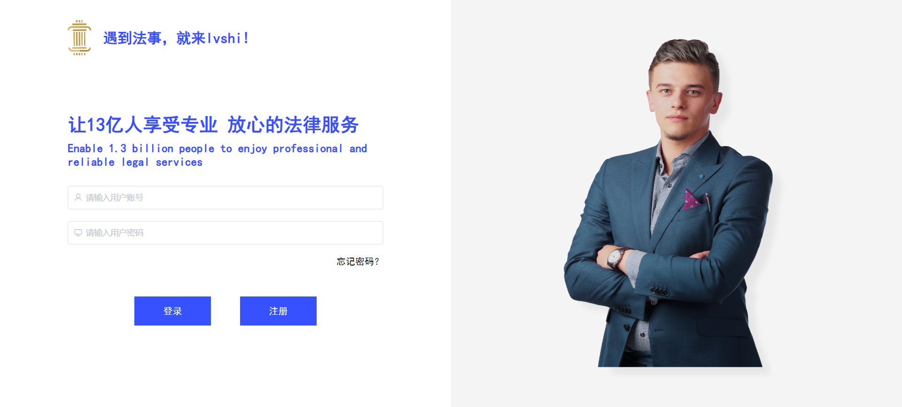

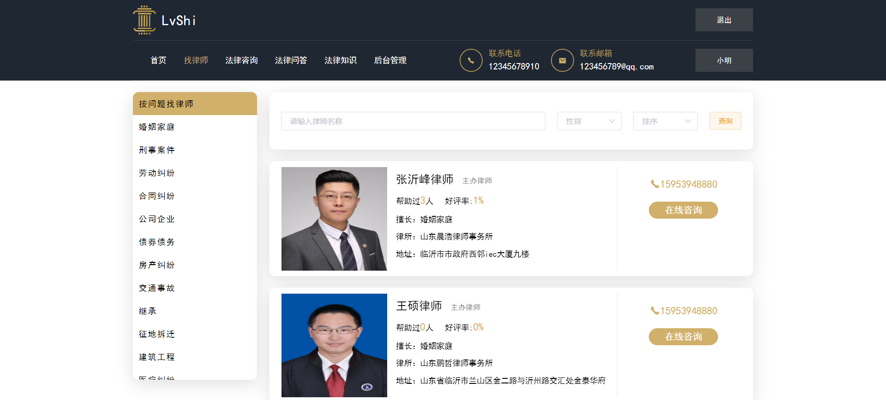
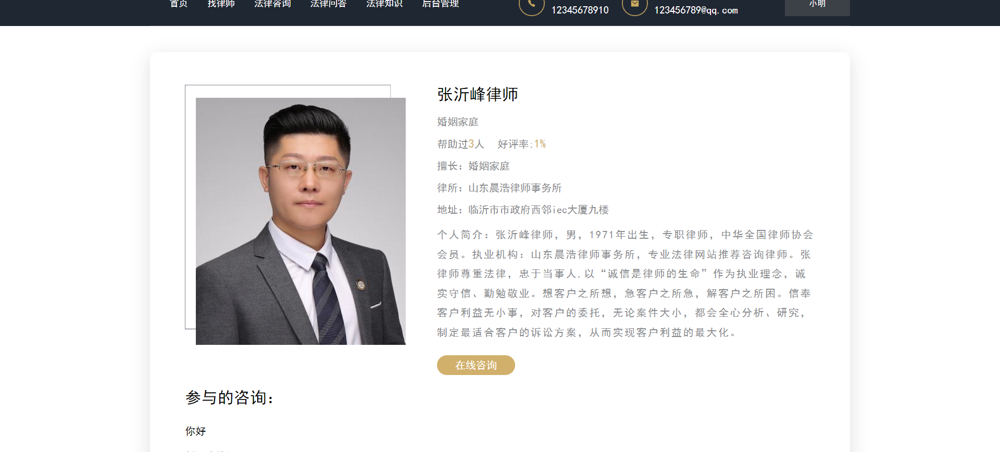
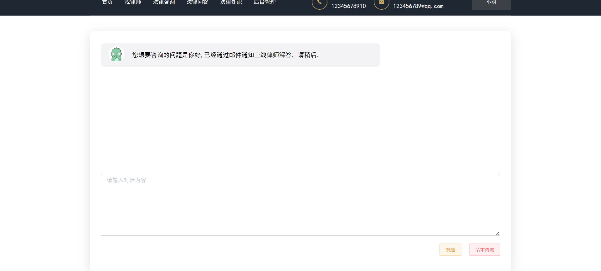
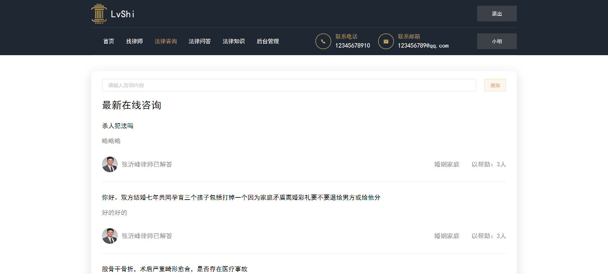
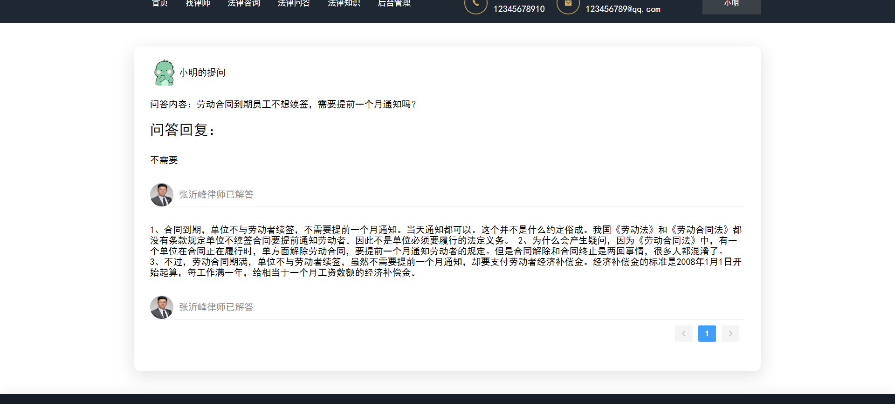
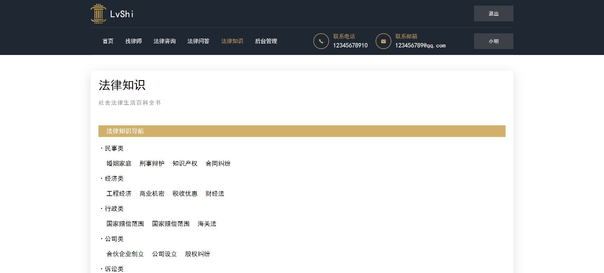
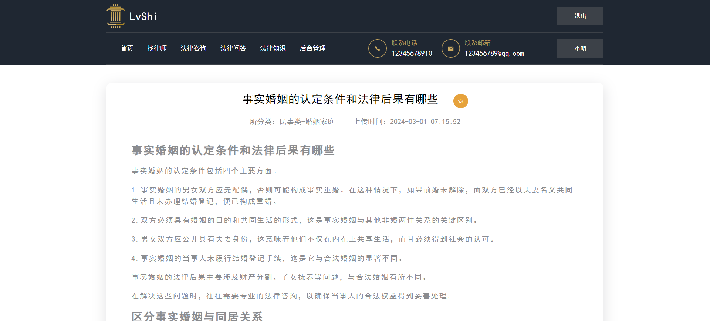
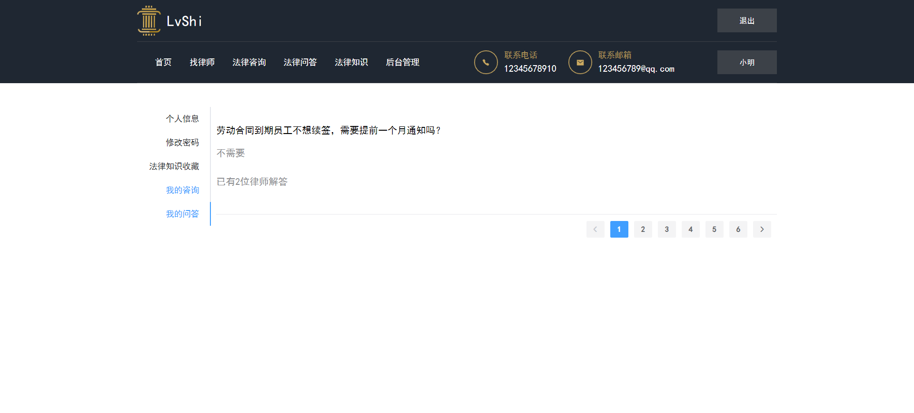
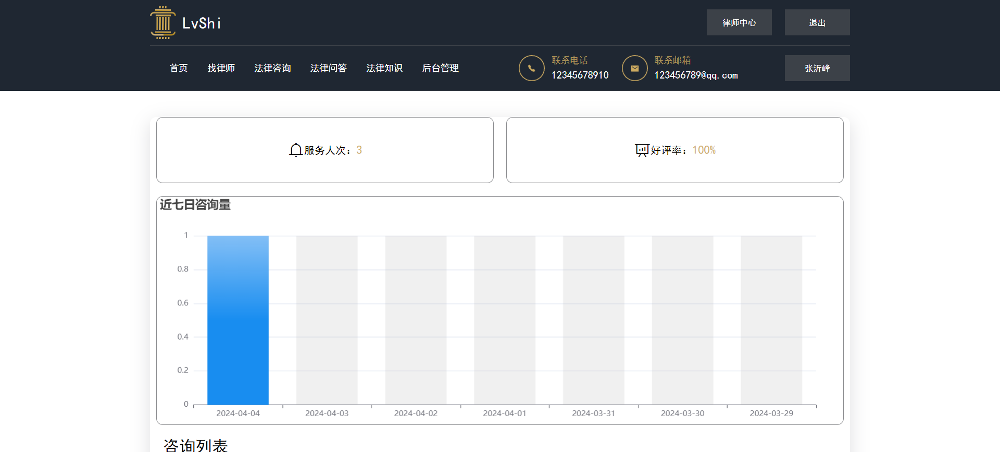
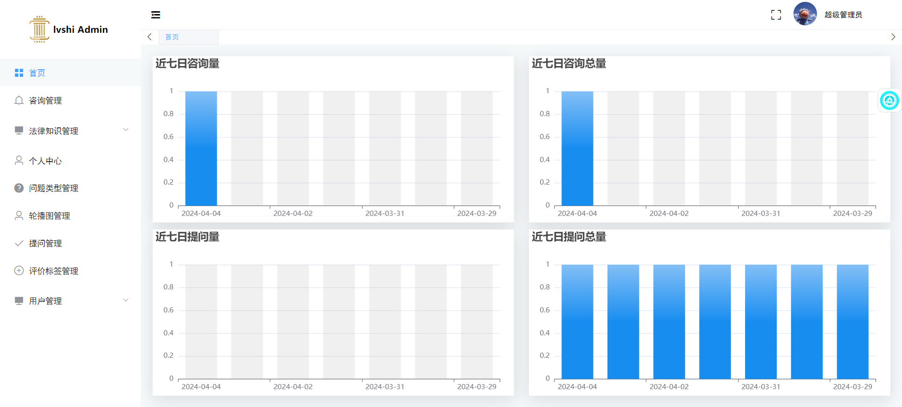

**有问题可以咨询企鹅Q1760272627** 

